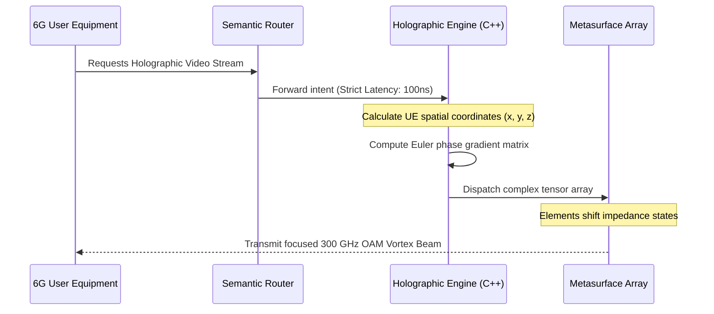

# Holographic MIMO & Continuous Aperture Metasurfaces

This document outlines the Terahertz (THz) physical layer of the 6G Core Engine. Unlike 5G, which relies on discrete antenna arrays, 6G utilizes Continuous Aperture Metasurfaces to shape radio waves holographically.

## The Holographic Phase Gradient

To target a specific User Equipment (UE) with a 300 GHz beam, the C++ Core Engine calculates a complex phase shift for thousands of microscopic meta-elements simultaneously. This creates constructive interference exactly at the spatial coordinates of the receiver.

## Orbital Angular Momentum (OAM) Multiplexing

Because THz frequencies suffer from extreme atmospheric attenuation, we must maximize spectral efficiency. The engine utilizes OAM to "twist" the electromagnetic wave.

By applying different topological charges (e.g., Mode +2, Mode -3), multiple independent data streams can occupy the exact same center frequency without destructive interference. The metasurface acts as a digital spiral phase plate to encode and decode these twists.
