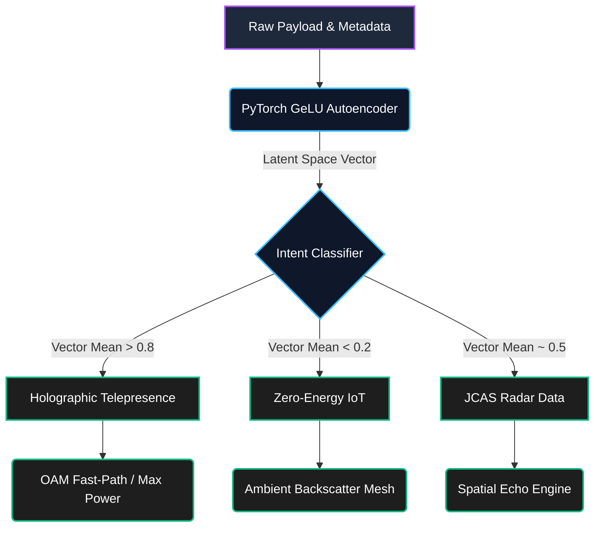

# AI-Native Semantic Routing Fabric

Standard IP routing relies on destination addresses and predefined Quality of Service (QoS) tags. The 6G Core Engine deprecates this in favor of **Semantic Routing**. 

The network evaluates the *intent* of the payload using an embedded PyTorch neural network, compressing the data into a latent vector space to make intelligent, nanosecond routing decisions.

## Latent Intent Classification

## Dynamic Network Slicing

By routing purely by intent, the C++ engine can dynamically provision hardware on the fly:

- **Holographic Traffic** triggers the OAM Multiplexer and allocates heavy CPU cycles for continuous metasurface adjustments.

- **IoT Traffic** completely bypasses the active transmitters, instead utilizing the BackscatterController to modulate data onto existing, ambient RF waves to save power.
